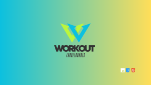
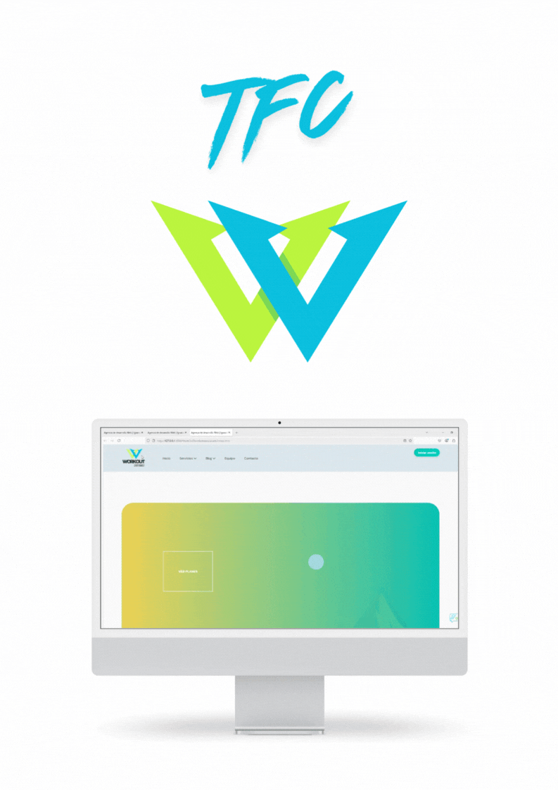

  

<strong>Aplicación real para entrenadores personales, desarrollada como TFC de DAM</strong> 
Con chatbot personalizado, WhatsApp, diseño responsive y escalabilidad real.

---

##  Descripción del proyecto

Workout Torrelodones es una plataforma web orientada a entrenadores personales.  
Permite ofrecer sus servicios de forma profesional, moderna y con interacción automática.

Incluye:
-  Diseño responsive limpio y accesible
-  Chatbot con IA entrenado con OpenAI API(Actualmente en construcción)
-  Enfoque real de negocio y escalabilidad

---

##  Mockups del proyecto

Estos mockups ilustran el diseño responsive y la experiencia visual planteada para  usuarios de la plataforma.

  
   
  
   
  

---

## 🛠️ Tecnologías utilizadas

  
  
  
  
  
  

## 📄 Documentación del TFC

## 📄 Documentación del TFC

### 🧾 Presentación visual

  

> Documento visual que resume el enfoque gráfico y funcional de la aplicación, incluyendo mockups y la estructura UI.

---

### 📘 Manuscrito del proyecto

  

> Documento técnico completo del TFC, incluyendo análisis de viabilidad, desarrollo, herramientas utilizadas y roadmap.

## 👨‍💻 Desarrollado por Ignacio Suárez Ruiz

  
   
  📧 igna1995@gmail.com

