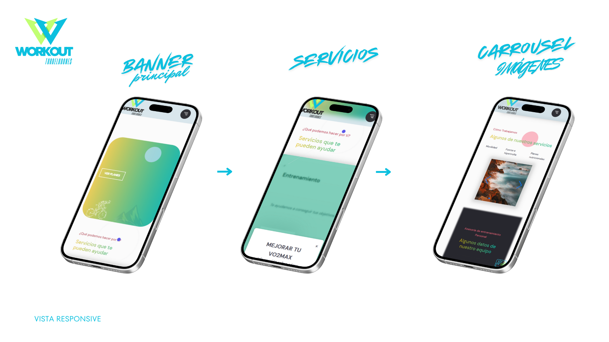
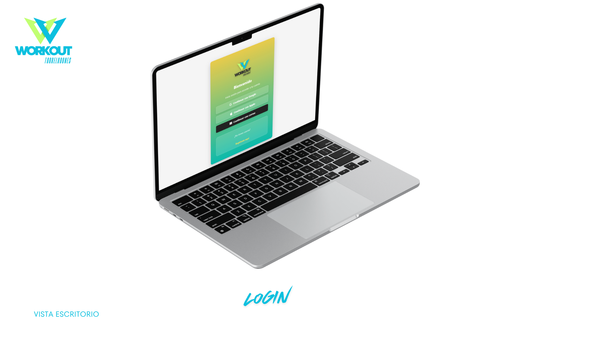
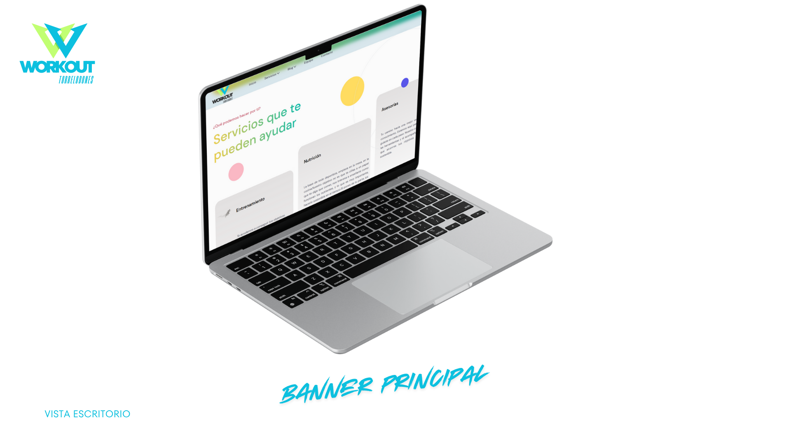

  

<strong>Aplicación real para entrenadores personales, desarrollada como TFC de DAM</strong> 
Con chatbot personalizado, WhatsApp, diseño responsive y escalabilidad real.

---

## 🔥 Descripción del proyecto

Workout Torrelodones es una plataforma web orientada a entrenadores personales.  
Permite ofrecer sus servicios de forma profesional, moderna y con interacción automática.

Incluye:
- ✅ Diseño responsive limpio y accesible
- ✅ Chatbot con IA entrenado con OpenAI API
- ✅ Formularios personalizados y contacto WhatsApp
- ✅ Enfoque real de negocio y escalabilidad

---

##  Mockups del proyecto

Estos mockups ilustran el diseño responsive y la experiencia visual planteada para entrenadores personales y usuarios de la plataforma.

  
   
  
   
  

---

##  Tecnologías utilizadas

- HTML · CSS · JavaScript
- OpenAI API (Chatbot IA)
- Canva (diseño visual)
- Visual Studio Code
- Hostinger (hosting)

---

## 📄 Documentación del TFC

📥 [Presentación visual (PDF)](assets/Clean_and_Modern_App_Portfolio_Mockup_Presentation.pdf)

---

## 👨‍💻 Autor

Desarrollado por Ignacio Suárez Ruiz  
🔗 [LinkedIn](https://www.linkedin.com/in/tuusuario)  
📧 1995igna@gmail.com
