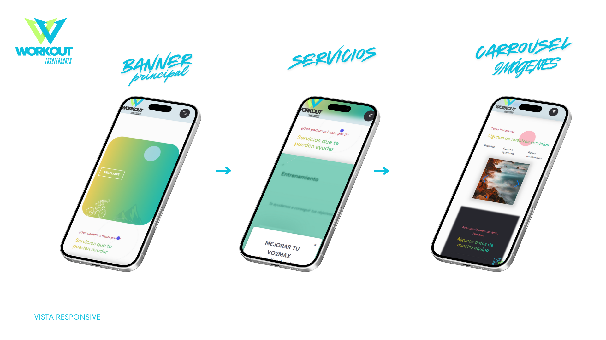
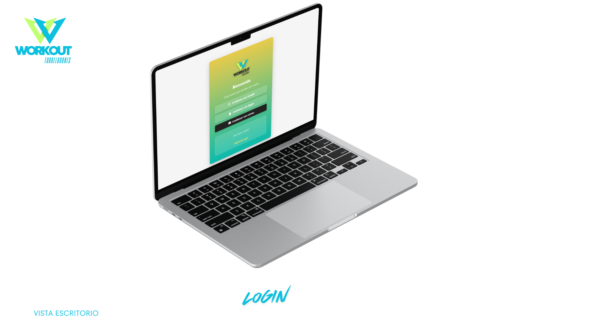
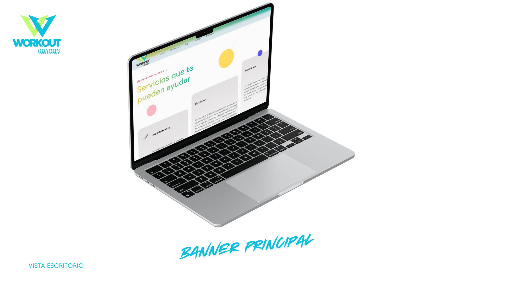
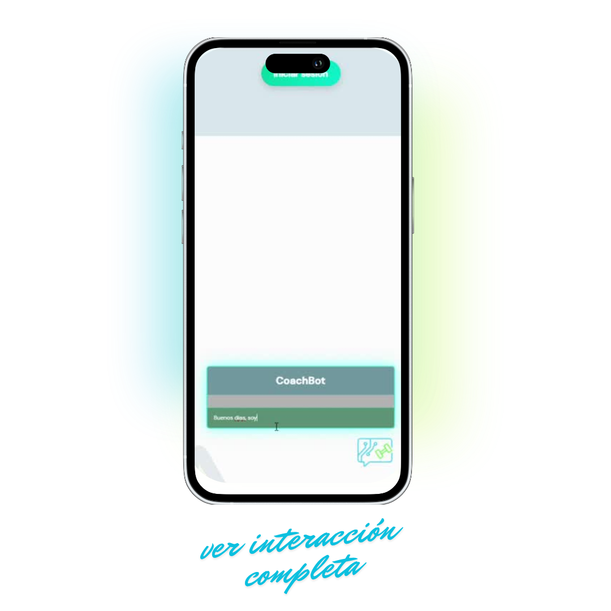
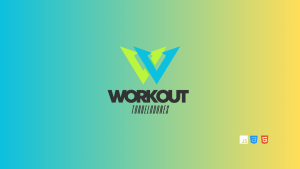
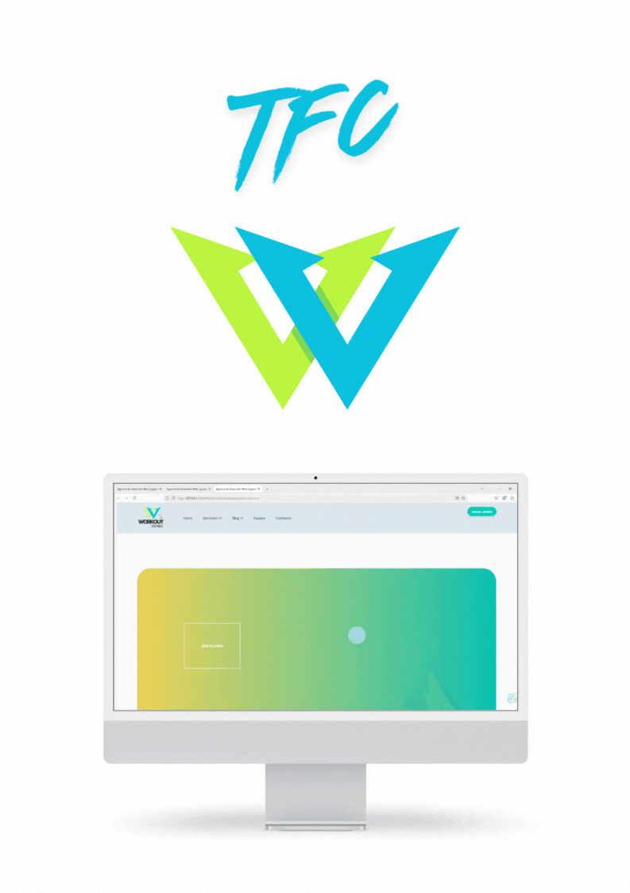

  

<strong>Aplicación real para entrenadores personales, desarrollada como TFC de DAM</strong> 
Con chatbot personalizado, WhatsApp, diseño responsive y escalabilidad real.

---

## 🧩 Descripción del proyecto

Workout Torrelodones es una plataforma web orientada a entrenadores personales.  
Permite ofrecer sus servicios de forma profesional, moderna y con interacción automática.

Incluye:
- Diseño responsive limpio y accesible
- Chatbot con IA entrenado con OpenAI API (Actualmente en construcción)
- Enfoque real de negocio y escalabilidad

---

## 🖼️ Mockups del proyecto

Estos mockups ilustran el diseño responsive y la experiencia visual planteada para usuarios de la plataforma.

  
   
  
   
  

---

## 🤖 Sección del Chatbot

El chatbot está diseñado con estética **cyberpunk**, ubicado en la esquina inferior derecha. Actúa como un entrenador personal digital con respuestas precisas y una personalidad marcada.

### 🎯 Funcionalidad:

- Responde sobre entrenamiento, nutrición y servicios de la web.
- Si se le pregunta algo fuera de tema, responde con un tono sarcástico y humorístico.
- Conectado a un backend propio (`coachbot-backend`) usando la API de OpenAI.
- Integración sencilla vía modal fijo con efecto blur al desplegarse.

### 🧠 Stack técnico:

- HTML, CSS y JavaScript
- API de OpenAI
- Estilos visuales inspirados en ciencia ficción
- Backend Express (Node.js) para control de contexto y temas válidos

### 🖼️ Mockup del Chatbot:

  

---

## 🛠️ Tecnologías utilizadas

  
  
  
  
  
  

---

## 📄 Documentación del TFC

### 🧾 Presentación visual

  

> Documento visual que resume el enfoque gráfico y funcional de la aplicación, incluyendo mockups y la estructura UI.

---

### 📘 Manuscrito del proyecto

  

> Documento técnico completo del TFC, incluyendo análisis de viabilidad, desarrollo, herramientas utilizadas y roadmap.

---

## 👨‍💻 Desarrollado por Ignacio Suárez Ruiz

  
   
  📧 1995igna@gmail.com

